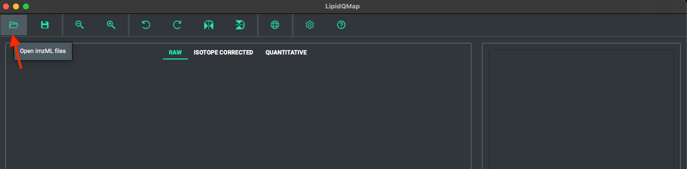
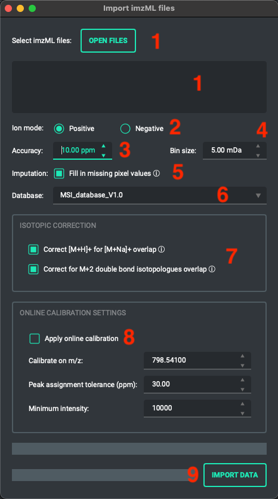
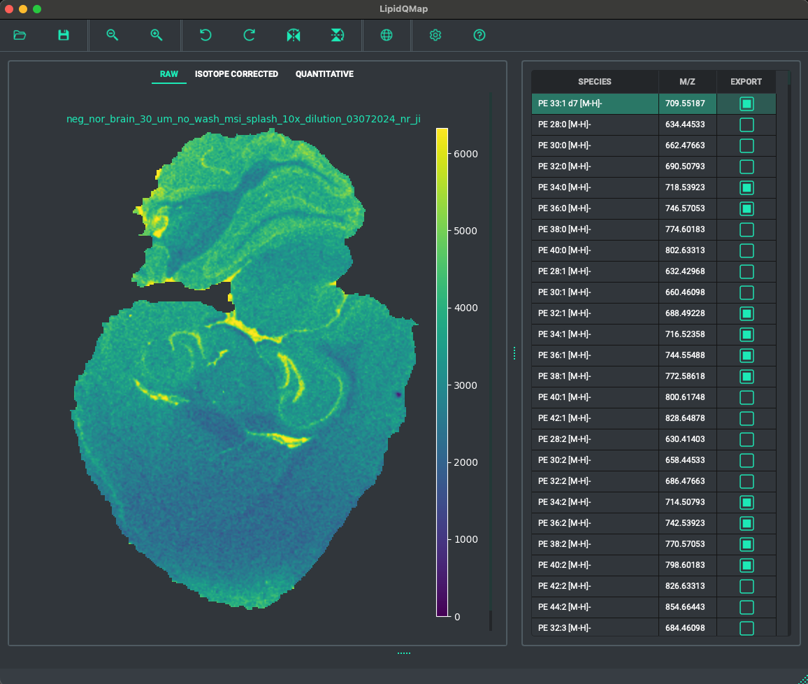
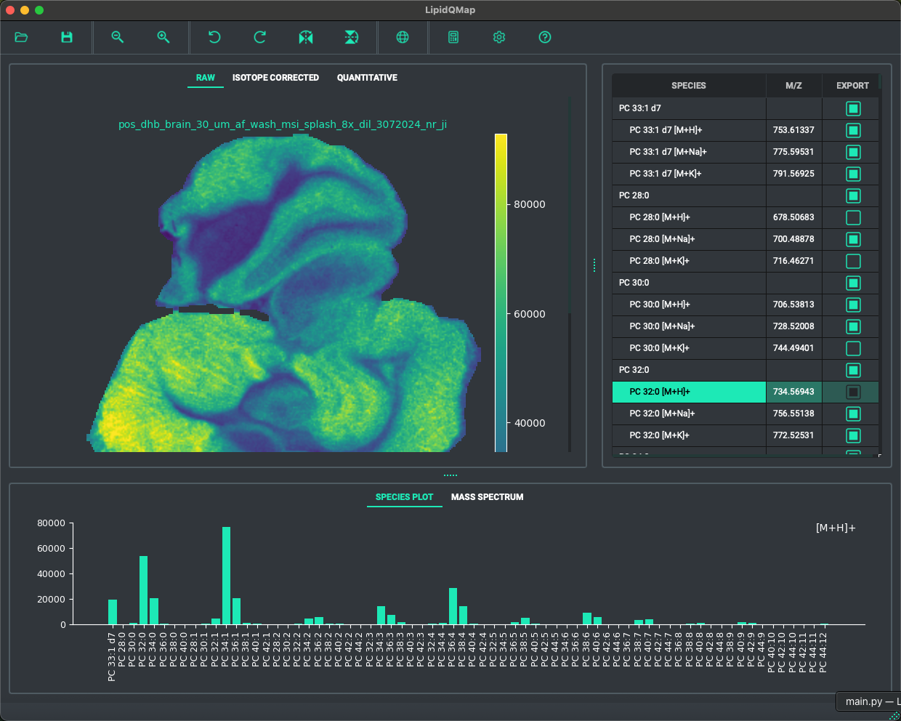
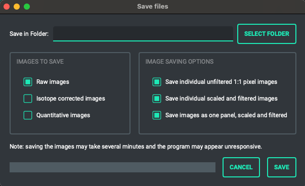
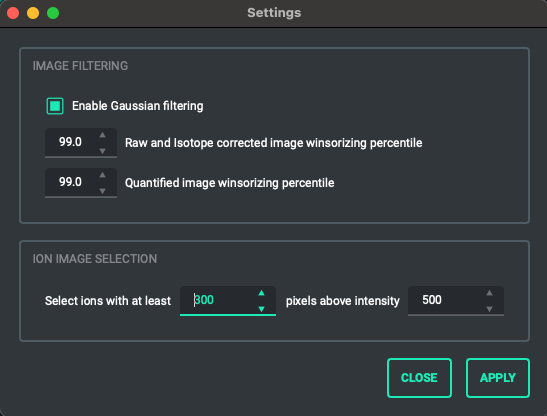

LipidQMap is a program to support accurate quantitation of Mass Spectrometry Imaging data. It has the following features:

- User friendly graphical user interface.
- Works on imzML data files and can open multiple imzML files simultaneously.
- Shows ion images for an easily editable list of lipids (list is read from an excel file).
- Can perform Type II isotopic correction, and can correct [M+H]+ adducts for isotopic overlap from [M+Na]+ adducts.
- Performs quantitation based on user defined internal standards.
- Can toggle view between raw, isotope corrected and quantified images.
- Is fast, opening a 5 GB imzML file and importing and quantifying 2500 ion images takes about 20 seconds on an M2 Macbook.
- Can show the average mass spectrum of an image, and can show a barplot of average ion intensities per lipid class.
- Can export the images, both as individual files or as image collection in panels.

## Installation

LipidQMap is available for Windows 10 (and up) and Mac (ARM, M1 and up).
Download LipidQMap from the [releases](https://TODO) page or get the latest version from the links below:

- [LipidQMap V1.0.0 - **Windows 10**](https://TODO)
- [LipidQMap V1.0.0 - **Mac**](https://TODO)

Simply unzip the downloaded file in any location and double click on the LipidQMap executable inside the extracted folder.
For operating systems other than Windows and MacOS, we refer to the [developer section](#for-developers) on how to run the app.
  

## Usage

### Opening imzML files
Click on the folder icon in the top left of the main program window to open the imzML import dialog.

1. In the imzML import dialog, click on the "**Open Files**" button to select one or more imzML files.
2. Select if the file contains positive or negative ion mode data.
3. Select the maximum tolerated mass error (in ppm) for for extracting the ion images.
4. Select the Bin size used for calculating the average spectrum (Default 5 mDa for TOF instruments, should be decreased for higher resolution instruments)
5. Select which database should be used in the Database dropdown menu.
6. Select which (if any) isotope correction algorithm should be used.
7. Select if online calibration should be applied to the images. This requires a reference m/z, a tolerance (in ppm) of the maximum allowed deviation from the reference mass, and a minimum intensity of the reference m/z. If these criteria are met, the spectrum of each pixel is shifted to match the m/z of the reference mass.
8. Click on "**Import Data**" to start importing the imzML files.

### Exploring the images
After importing the imzML files, the ion images will be displayed in the main window. 

The **Species table** on the right gives an overview of the lipid species in the database. Clicking on these species in the table will update the view of the current ion image. The "Export" column in the table marks if a species should be considered for exporting to an image file, this can be toggled by clicking on the checkboxes, or by pressing the spacebar on the keyboard for the currently highlighted species. The **currently selected species** can also be changed with the Keyboard Up and Down buttons, or Left and Right to jump to the next species marked for export.

In the top of the image view pane, the ion image view can be toggled between Raw data, Isotope corrected data, or Quantitative data (the quantitative data is also isotope corrected, if isotope correction was chosen in the file import dialog). Keyboard shortcuts to toggle between these views are R, I and Q.

The menu bar at the top of the window has buttons to **zoom** in and out on the images, and to apply **rotations** or **reflections**. If multiple images are loaded, these transformations are performed on the image that has been selected by clicking on it. The "**Global scale**" button in the menu sets all imzML images (if multiple were loaded) to the same intensity scale.

At the bottom center of the window, there are five small green dots that can be clicked and dragged upward to reveal the **species bar** plot and the **average mass spectrum** of the currently selected imzML file. The species bar plot displays all lipid species from one adduct form of one class. This plot updates when a species from a different class and/or adduct is selected in the species table. The mass spectrum view allows for zooming in and out by scrolling the mouse wheel while hovering over the figure or its axis with the cursor. Double-clicking on the axis will zoom out. Alternatively, clicking and dragging a selection on the mass spectrum plot will zoom in on the selected area. Selecting a different species in the species table will update the mass spectrum view to center on the newly selected species.

### Saving the images
Images can be saved by clicking on the "**Save images**" button in the top left menu. This will open the "Save files" dialog window.
Use the "**Select folder**" button to choose a saving destination. The save dialog has the option to save Raw, Isotope corrected and Quantitative images. **Only lipid species that are marked for export** in the species table in the main menu will be saved. There are also the following options:

- "**Save individual unfiltered 1:1 pixel images**". This option saves a separate image for each imzML file, for each lipid species. These images are unfiltered, and not scaled (=each pixel in the imzML file is mapped directly to a pixel in the exported image without scaling)
- "**Save individual scaled and filtered image**" This option saves a separate image for each imzML file, for each lipid species. These images are Gaussian filtered (if this option is selected in the main settings menu), and scaled, resulting in a high resolution interpolated images.
- "**Save images as one panel**" This option is relevant if multiple imzML files are loaded simultaneously. It saves a combined image panel containing all the imzML files, but separate for each lipid species. These images are Gaussian filtered (if this option is selected in the main settings menu), and scaled, resulting in a high resolution interpolated images.

### Changing settings
The Settings menu, which can be opened by clicking on the "**Settings**" button on the right side of the menu bar at the top of the main window. The following settings can be configured:

- **Gaussian filtering**: can be toggled on or off.
- **Winsorizing** percentiles (separate for the Raw/isotope corrected images or the quantitative images). Pixel intensities above the nth percentile, are set to the max intensity within the percentile. Set to 100 of no Winsorizing is desired.
- **Ion image selection**: after loading an imzML file, species with at least x pixels with an raw signal intensity above y, are selected for export in the Species table. If multiple imzML files are loaded, species are selected for export if in at least one imzML file the set criteria were met.

### Modifying or creating a new database
LipidQMap's Excel database(s) of lipid species are located inside the `_internal/database` directory in the LipidQMap installation folder. This folder should contain at least one Excel database file, but can contain multiple. During file import one of these databases can be selected in the imzML import dialog. Each row in the Excel database represents a different species, and the file should contain the following columns (the column titles need to match exactly):

- **ID**: any name / identification given to the species.
- **Class**: the lipid class of the species.
- **Neutral formula**: the neutral formula of the species.
- **Adducts**: the adduct forms of the species, separated by a comma if multiple.
- **M-2 isotope**: The ID of the species with one double bond more than the current one, only required if the type II isotope correction algorithm is used.
- **Na+ isotope**: The ID of the species with 2 carbons less and 3 double bonds more than the current one, only required if the sodium isotope correction algorithm is used.
- **IS amount (pmol / mm2)**: If this species is a standard, how much pmol per mm2 was sprayed.
- **IS**: ID of the standard species that should be used for the quantitation.

## Support

If you encountered a bug in LipidQMap, let us know by opening an Issue:
1.  On the top menu of this github page, click on  **Issues**, and then click on **create an issue.**.
2.  Fill in the form and click on **Submit new issue**.

## For Developers

LipidQMap is open to contributions, let us know if you want to contribute!

LipidQMap is created with Python 3.12. Useful utility functions to set up the project and get started can be found in the project Makefile (the Makefile was made for MacOS, some of the commands such as creating a virtual env are platform specific and should be adapted for Windows). In Visual Studio Code, open the project directory and in the terminal simply type: `make setup`  to create a virtual environment and install the required packages. Type `make run` to run the application. Consult the Makefile for other useful functions.

The GUI was created in Qt (PySide 6) using Qt Designer. If the project has been setup as instructed above with the virtual environment and dependencies installed, the designer program can be found in the the project folder under: `app/venv/lib/python3.12/site-packages/PySide6/Designer`. The Qt Designer .ui files are located in `app/resources/views/`, after edits have been made to these ui files, they have to be converted to python files in `app/generated/` using Pyside's pyside6-uic. This can be done with the Makefile command `make ui`. If additional resource files are added to the GUI (images, icons) the `make res` command needs to be ran as well.

PyInstaller is used to package the app, use `make build`.

  

## Authors and acknowledgment

TODO

  

## License

TODO